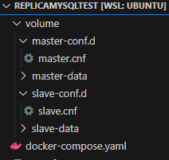
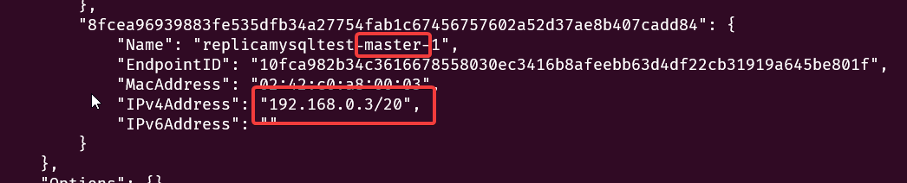

# Mysql Master Slave 設定

## 情境
在主要硬碟故障時,可以透過修改程式connect string切換到備援DB,最短時間恢復服務,
並且達到最少資料損失

不過透過硬碟raid可能更方便,可以處理所有服務,log的備份,並且抽換硬碟和改硬碟代號更容易

# 小注意

當硬碟掛掉時,Mysql服務可能不會馬上自動停止,要有資料庫操作之後,發生錯誤才會停止服務

# 建立Master , Slave

## Master設定

config 調整以下,並重起服務

第一次設定除了server-id要找到預設值改掉,其他設定可以直接貼到設定最下面(不包含[mysqld])

```yaml
[mysqld]
server-id                  = 1
log_bin                    = /var/lib/mysql/mysql-bin.log
binlog_expire_logs_seconds = 2592000
max_binlog_size            = 100M
# binlog_do_db              = include_database_name
binlog_ignore_db           = information_schema
binlog_ignore_db           = mysql
binlog_ignore_db           = performance_schema
binlog_ignore_db           = sys
```

- `server-id`每台 MySQL 的唯一碼，不論 master 或 slave 皆不可重複。
- `log_bin`Master 的 binlog 路徑。
- `binlog_expire_logs_seconds`Binlog 檔案保留的秒數，超過即刪除，避免塞爆硬碟，預設值為 2,592,000 秒，相當於 30 天。（並非真的逐秒檢查，而是有資料異動時檢查）
- `max_binlog_size`每個 binlog 檔案的大小，超過就會產生下一個 binlog 檔案，預設值 100 MB。
- `binlog_do_db`要複寫的資料庫，如果有多個就建立多筆 `binlog_do_db` 的設定。
- `binlog_ignore_db` 不要複寫的資料庫，忽略 MySQL 內建的四個系統資料庫。

新建帳號&權限

```yaml
# master mysql cmd
CREATE USER 'replica'@'%' IDENTIFIED WITH mysql_native_password BY 'replica-password';
GRANT REPLICATION SLAVE, REPLICATION CLIENT ON *.* TO 'replica'@'%';
FLUSH PRIVILEGES;
```

## Slave 安裝

選一個方式就好

- 新Mysql Instance , 如果Master已經有資料或Database,會需要[手動同步](#手動同步新安裝slave)一次
- [複製Master整個資料夾](#新建slave複製master)

## Slave設定

在config調整以下,並重起服務

第一次設定除了server-id要找到預設值改掉,其他設定可以直接貼到設定最下面(不包含[mysqld])

```bash
[mysqld]
server-id = 11
replica_load_tmpdir = /var/tmp
max_binlog_size   = 100M
read_only = 1
relay_log = test-mysql-relay-bin
relay_log_recovery = 1
```

- `server-id`每台 MySQL 的唯一碼，不論 master 或 slave 皆不可重複，可參考MasterId+SlaveID，假設Master為1,第一台Slave :11 ，第二台Slave :12
- `read_only`Slave 除了複寫外，不開放其他User寫入(這不包括管理員權限的帳號)。
- `relay_log` Slave 的 relay log 的名稱
- `replica_load_tmpdir`複寫的暫存目錄
- `relay_log_recovery` 啟用內建復原機制

新增同步設定ip,帳號

```sql
# slave mysql cmd
STOP REPLICA;

CHANGE REPLICATION SOURCE TO
  SOURCE_HOST = '127.0.0.1',
  SOURCE_PORT = 3406,
  SOURCE_USER = 'replica',
  SOURCE_PASSWORD = 'replica-password';
 
START REPLICA;
```

如果設定錯誤然後不給改的話

```sql
# slave mysql cmd
stop replica;
reset slave;
start replica;
```

最後 [檢查同步狀況](#檢查同步設定)

# 維護

## 新建Slave(複製Master)

```jsx
# shell
# 停止資料庫服務
# MySQL80 替換電腦上mysql service name
net stop MySQL80
```

複製主資料庫資料和my.ini到其他位置

修改複製my.ini的dataDir資料庫儲存路徑 & port

[修改Slave設定](#slave設定)

修改資料庫儲存路徑裡面的auto.cnf裡面的uuid

```jsx
# shell
# 新建mysql 服務
# 替換mysql執行檔路徑 服務名字 my.ini路徑
"C:\Program Files\MySQL\MySQL Server 8.0\bin\mysqld.exe" install MySQL80Slave --defaults-file="F:\my.ini"
# 啟動服務
net start MySQL80
net start MySQL80Slave 
```

## 從Slave還原Master

複製slave整個資料夾到Master的位置

修改auto.cnf裡面的uuid(不一樣即可)

```sql
# master
flush logs;
show master status;
```

記下輸出的File和Position

```sql
# slave
stop replica;
change replication source to SOURCE_LOG_FILE='上面的File',SOURCE_LOG_POS=上面的Position;
start replica;
```

## Slave斷線回復

先重起Slave服務

```sql
# slave
show replica status
```

檢查所有Last Error

沒有任何錯誤的話就OK

如果有錯誤必須 手動排除錯誤 或 [重建Slave](#新建slave複製master)

## 檢查同步設定

```sql
# master
SHOW MASTER STATUS;
```

File會寫上面設定的log-bin的名稱

```sql
# slave
show replica status
```

Replica_IO_State會寫Waiting for source to send event
如果是connecting to source,檢查設定ip & 帳號

所有的Last XXX Error要是空的(有好幾個)

## 重起同步

```sql
# slave 
stop replica;
start replica;
```

# 其他

## 手動同步(新安裝slave)

如果master已經有資料&Database,需要先手動dump到slave

```yaml
# master mysql cmd
# 鎖全部表
# 需要停機,所有表會無法寫入!!!
flush tables with read lock;
set global read_only=1;
```

```bash
# master shell 備份
$ mysqldump -uroot --all-databases -p --result-file=./all.sql
```

```bash
# slave shell 還原
$ mysql -u root -p < all.sql
```

```bash
# master mysql cmd
# 解鎖
unlock tables;
set global read_only=0;
```

## Slave 轉換成 新Master

修改要被升級的Slave config

- 修改server-id
- 移除Slave設定
- 新增Master設定
- 重起服務
- 新增新的Slave
- Dump 新Master到新Slave

## 使用docker compose

新增一個資料夾,

```yaml
# docker-compose.yaml
version: '3.1'

services:

  master:
    image: mysql
    restart: always
    environment:
      MYSQL_ROOT_PASSWORD: abc123
    ports:
      - 3406:3306
    volumes:
      - ./volume/master-data:/var/lib/mysql
      - ./volume/master-conf.d:/etc/mysql/conf.d
    networks:
      network:
        ipv4_address: 192.168.100.2
  slave:
    image: mysql
    restart: always
    environment:
      MYSQL_ROOT_PASSWORD: abc123
    ports:
      - 3407:3306
    volumes:
      - ./volume/slave-data:/var/lib/mysql
      - ./volume/slave-conf.d:/etc/mysql/conf.d
    networks:
      network:
        ipv4_address: 192.168.100.3

volumes:
  master-data:
  slave-data:

networks:
  network:
    driver: bridge
    ipam:
      config:
        - subnet: 192.168.100.0/24
          gateway: 192.168.100.1
```

兩個mysql 資料庫檔案會放在 ./volume 的資料夾裡

master的設定檔放在 `./volume/master-conf.d` 裡面新增 xxx.cnf 檔案

slave的設定檔放在 `./volume/slave-conf.d` 裡面新增 xxx.cnf 檔案



```bash
#在含有docker-compose.yaml資料夾中
# 啟動
docker compose up -d
# 關閉
docker compose down
```

~~找 container ip~~

(參考上面yaml, 設定container固定ip)

```bash
# shell
docker network inspect 資料夾名
```

~~找到Name含有master的~~ 

